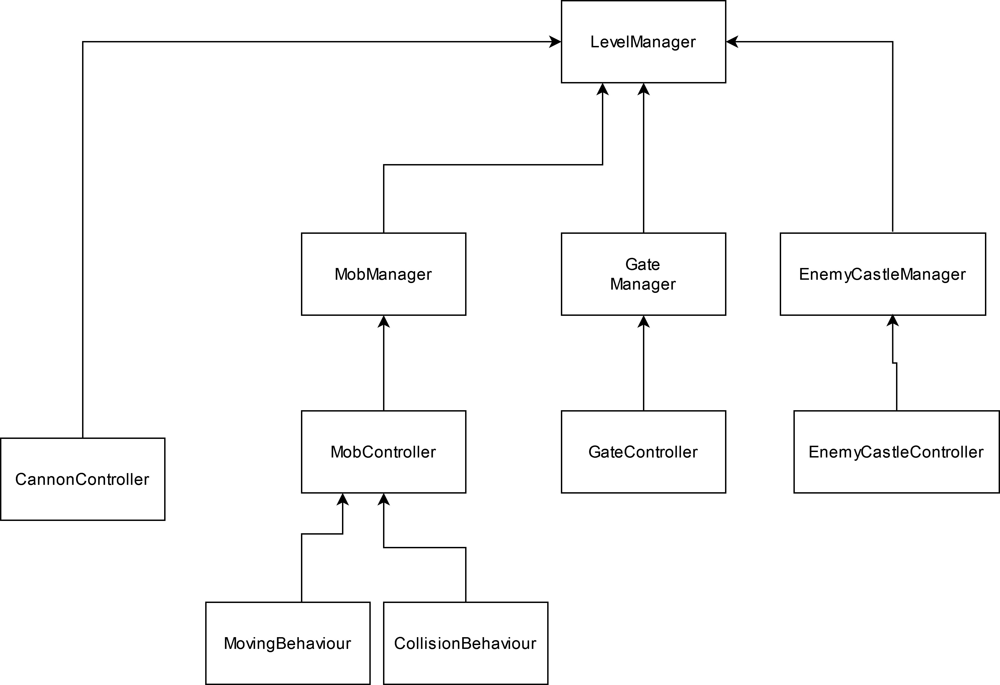

  # Mob Rush Documentation  
  Here I've briefly pointed out anything about project structure or implementation flow that I think worth mentioning.
  
  ## Structure 🚀  
  Here the structure of the project classes has been described in a top-down approach:
  - The main scene of the game ("Game" scene) contains a `MonoBehaviour` called `LevelManager` on a GameObject with the same name. this class has every other scripts that manage each part of the gameplay.
  - There are many `non-MonoBehaviour` classes refered as managers. the naming convention of them is like `FooManager`, which is a class that manage `Foo`. the real examples are `MobManager`, `GateManager`, `EnemyCastleManager`. Each class is in charge of managing something.
  - Every `MonoBehaviour` class that supposed to control a GameObject uses the `BarController` convention. like `MobController`, `CannonController`, ...
  - different behaviours of some objects, like mobs, exists in classes with `XBehaviour` naming convention. like `MovingBehaviour` and `CollisionBehaviour` for mobs.

  The overal structure of the code is as bellow.  
  
  
  ## Other Notes and Challenges 🔥  
  - First of all, I've used `static Action` for memory usage. Since Actions are allocation based and for each Action and it's subscribed callbacks the `Garbage Collector` has to allocate some memory, using them for objects that must be instantiated a lot in the game (Like "Mobs" in this one) means allocating a lot of memory. So, Instead of defining Actions as class `non-static` members, I've defined them as static member and each object that manages to `Invoke` that Action, has to pass itself as the first parameter to the callbacks. This way Instead of allocating `heap` memory for an Action on each object instance. there is only a single static one that every instance useing it. (I came out with this idea in WC so I don't really know it works or not, but it seams valid enough!:D)
  - I've used `static Action` again to avoid using `Singleton`s (I'm starting to fall in love with this static Action thing). As `Singleton`s make it difficult to manage contexts, I prefer not to use them. Also, one of the most important advantages of the `Singleton` classes is thair accessibility through the project. so I've used this to achieve that:
  
      1. The used to be `Singleton` class containes an `static Action`
      2. Instances of the The used to be `Singleton` class subscribe to that Action upon initializing.
      3. Any other class that needs to call a function from the former `Singleton` class now can invoke the `static Action`. Instances of the former `Singleton` class has already subscribed the needed method to that Action, so it's just like calling a `Singleton` object instance method. 

  - For mobs creation and deletion, used Unity's built-in `ObjectPool`
  - For async functions, used `UniTask`
  - Realized that it's not good to use the `ObjectPool`'s `Get` and `Release` function inside `UniTask` casue it's not thread-safe
  - I really wanted to work on the visual aspects of the project but I ran out of time.
  - As Mobs dying VFX, there is a dissolve shader on them. but it's not noticable much.
